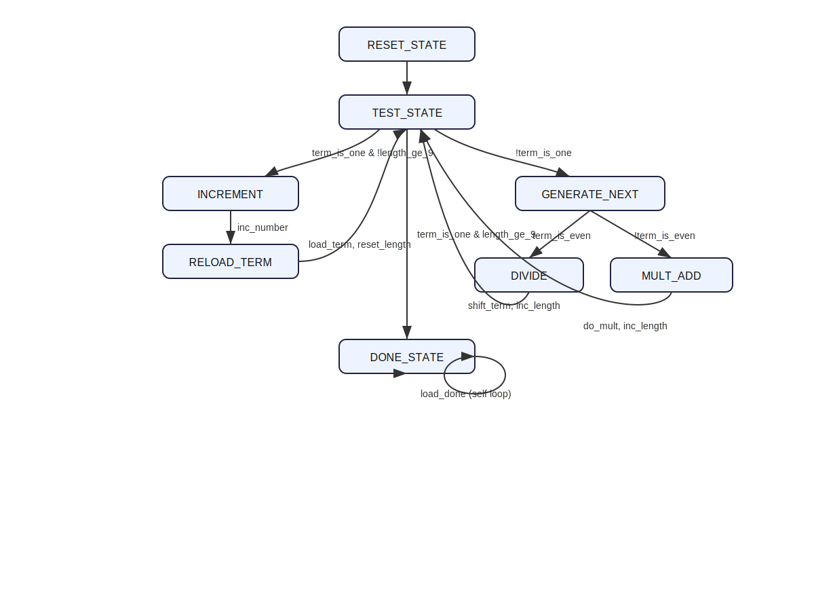
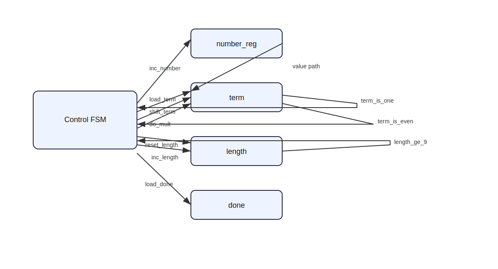

# 3k+1 Hardware Generator on FPGA

A VHDL/FPGA implementation of the **3k+1 (Collatz) sequence generator**, built in two RTL styles and verified through simulation + synthesis.

---

## Project Overview

This project finds the **smallest positive integer `k` whose 3k+1 sequence has at least 9 terms**, using hardware-oriented RTL design.

Two implementations are included:

1. **Single clocked process** (`part1.vhd`)
2. **ASM-style datapath + control unit** (`part2.vhd`)

Both produce the same functional outcome and were carried through simulation and FPGA implementation flow.

---

## Visual Architecture

### ASM State Chart

### Datapath / Control Block Diagram

---

## Key Result

- Smallest `k` with sequence length **≥ 9**: **6**

---

## Repository Structure

| Path | Description |
|---|---|
| `part1.vhd` | Single-process RTL implementation |
| `part2.vhd` | ASM datapath/control RTL implementation |
| `3k.xdc` | Nexys A7 constraints |
| `part1.do` | ModelSim script for part 1 |
| `part2.do` | ModelSim script for part 2 |
| `part1_wave.pdf` | Waveform output for part 1 |
| `part2_wave.pdf` | Waveform output for part 2 |
| `docs/architecture.md` | Architecture notes + diagram sources |
| `docs/results.md` | Validation summary |
| `process.bit`, `asm.bit` | FPGA bitstreams |
| `process.vdi`, `asm.vdi` | Implementation/synthesis logs |

---

## Technical Stack

- **VHDL** (`numeric_std`, synthesizable RTL)
- **ModelSim** for simulation
- **Vivado** for synthesis/implementation
- **Nexys A7 FPGA** target board

---

## Reproducibility

### Simulate
- `do part1.do`
- `do part2.do`

### Synthesize/Implement
1. Open project in Vivado.
2. Add either `part1.vhd` or `part2.vhd`.
3. Apply `3k.xdc`.
4. Run synthesis, implementation, and bitstream generation.

---

## Engineering Highlights

- Clean arithmetic with `numeric_std`
- Explicit width handling (`resize`) for safe synthesis behavior
- FSM-based control flow (no non-synthesizable `while` loop dependence)
- Two architecture styles demonstrating design trade-offs:
  - compact single-process RTL
  - modular control/datapath partitioning

---

## Why This Project Is Relevant

This repo demonstrates practical digital design skills:

- RTL state-machine design
- Datapath/control decomposition
- Cycle-accurate hardware reasoning
- Simulation-based verification
- FPGA build flow to bitstream artifacts
