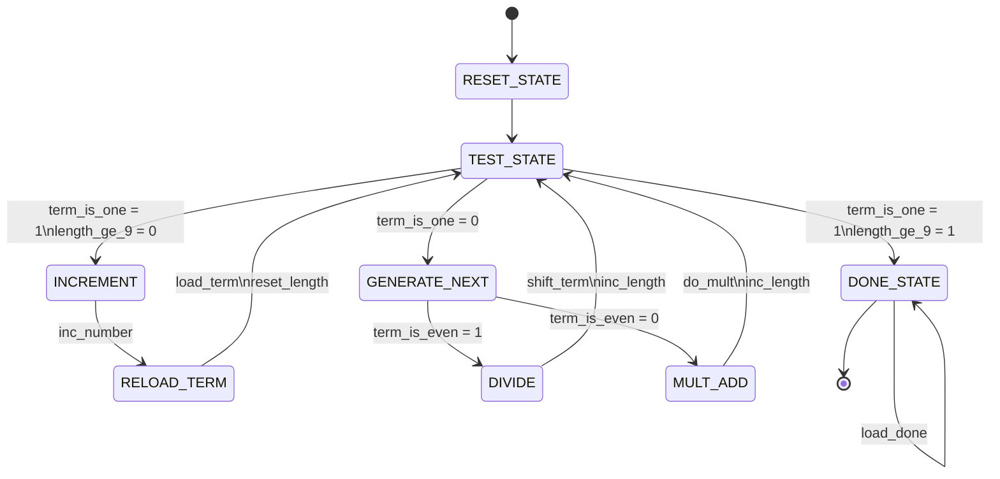
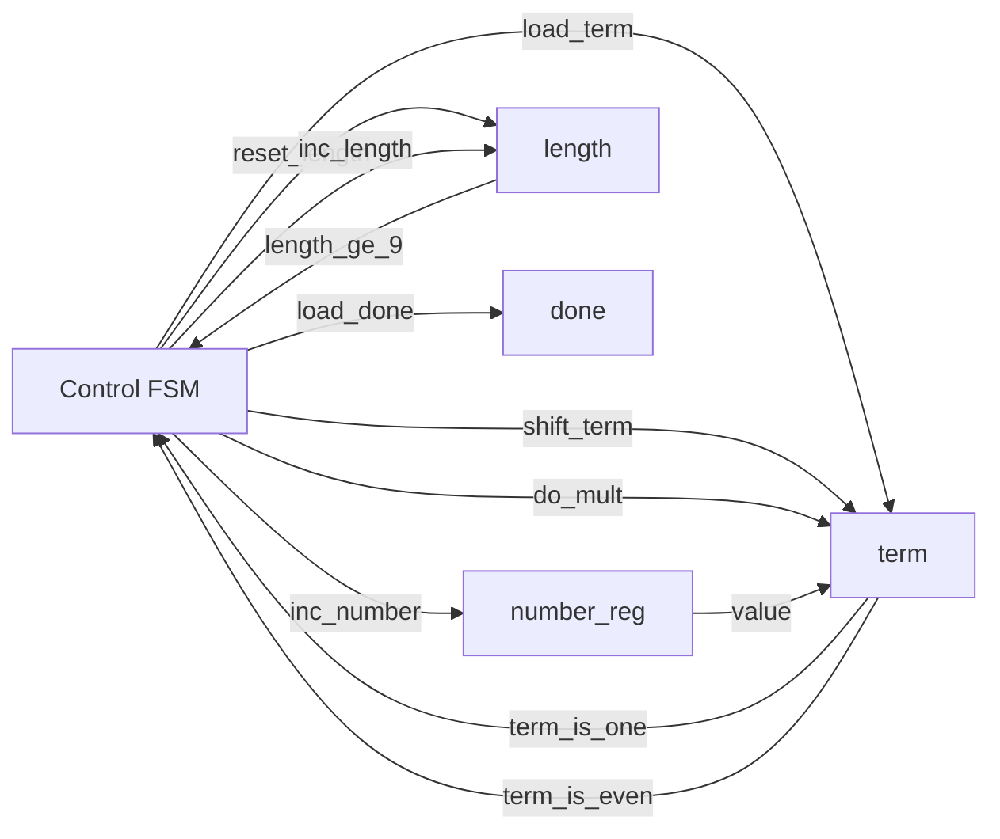

# System Architecture

This document captures the control-state and datapath/control decomposition for `part2.vhd`.

## ASM Chart (Control FSM)

### Mermaid source

### Exported image assets

- SVG: `docs/assets/asm_chart.svg`

## Datapath / Control Block Diagram

### Mermaid source

### Exported image assets

- SVG: `docs/assets/datapath_control.svg`

## Repository note

This repository keeps diagrams as Mermaid source and SVG exports only (no PNG binaries) to stay compatible with PR systems that reject binary files.
